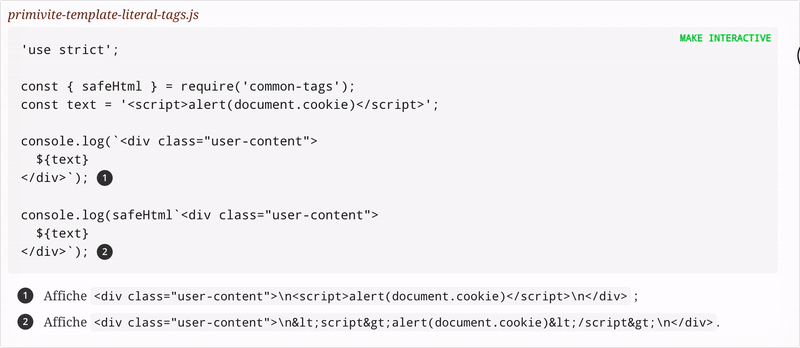

# Asciidoctor Interactive Runner

> Transform Asciidoc code listings into interactive playgrounds which run in the browser. Simply add the `%interactive` option to your `[source]` block.

As of now, the extension is compatible with **javascript** source code only, handled with the [runkit runner][].



# Install

```bash
npm i asciidoctor.js asciidoctor-extension-interactive-runner
```

# Usage

## In your content

```adoc
[source%interactive,javascript]
----
const {camelCase} = require('lodash');

console.log(camelCase('get content'));  // <1>
----
<1> Now you can see the output of this line in the browser.
```

## Asciidoctor Conversion

```js
const Asciidoctor = require('asciidoctor.js')();
const runnerExtension = require('asciidoctor-extension-interactive-runner');

Asciidoctor.Extensions.register(runnerExtension);

Asciidoctor.convertFile('path/to/content.adoc', {
  to_file: 'path/to/content.html',
  backend: 'html5',
})
```

# License

[MIT License](LICENSE).

[runkit runner]: https://runkit.com/npm/
